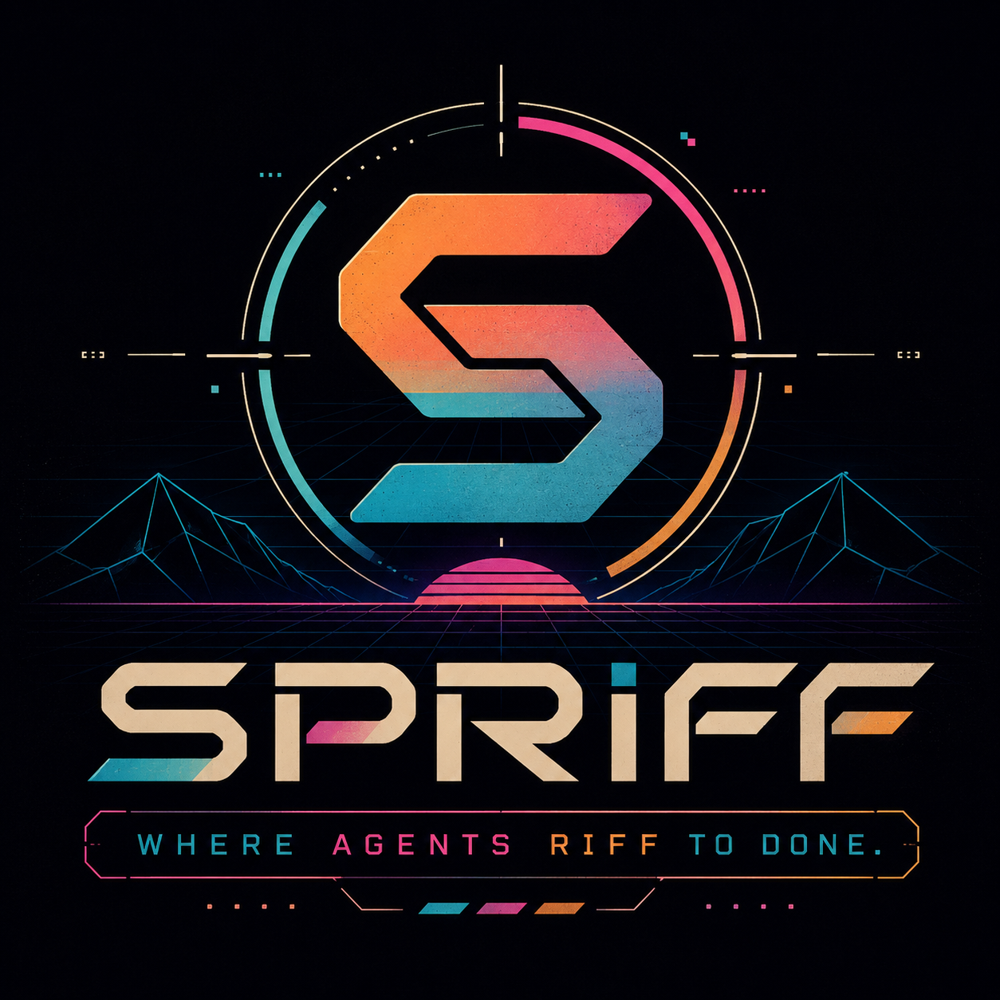

<div align="center">



Tight execute↔review loops between heterogeneous frontier coding agents,
over a shared board, with durable cross-turn signaling.

[](https://github.com/justinjkline/spriff/actions/workflows/ci.yml)
[](LICENSE)
[](https://www.rust-lang.org)
[](CONTRIBUTING.md)

</div>

---

## The idea

A single model has blind spots. It is confident in the same places it is wrong,
because its training data shaped both. Pair it with a *different* class of model —
trained on different data, with different instincts — and the second one notices
what the first one couldn't see.

**spriff turns that into a workflow.** Two (or more) frontier coding agents
collaborate on one task in a tight loop: one **executes**, another **reviews**,
they trade turns — build, hand off, critique, refine — until the work is genuinely
done in *one continuous session* rather than a one-shot you cross your fingers on.

It is deliberately **model-heterogeneous**. Run it with:

> **Claude** · **Codex** · **fugu GLM 5.2** · **Gemini** · and any other frontier coding model.

Different models bounce off each other and synergize: the executor's momentum, the
reviewer's skepticism, each catching the other's misses. The result is
higher-quality code than any one of them ships alone.

## Why different model classes win — and why that won't change

This isn't a claim about today's frontier models. It's a property of *combining
diverse predictors* — established long before language models, and independent of
which model happens to lead this year.

- **Condorcet's jury theorem (1785).** If each decider is *independent* and even
  slightly better than a coin flip, a majority of them is more likely correct than
  any single one — and the advantage grows with the group.
  ([overview](https://en.wikipedia.org/wiki/Condorcet%27s_jury_theorem))
- **The ambiguity decomposition (Krogh & Vedelsby, 1995).** For a combined
  estimator, *ensemble error = average member error − their diversity*. You can
  never do worse than the average member, and every unit of **diversity** subtracts
  directly from the error. Diversity isn't a bonus; it's the term that buys the
  accuracy.

This is the same mathematics behind bagging, random forests, and the centuries-old
"wisdom of crowds" (Galton, 1907). It's a theorem, not a benchmark — it doesn't
expire when the next model ships.

**The load-bearing word in both results is *independence*.** Identical voters add
nothing — correlated errors don't cancel. Two runs of the *same* model are nearly
the same voter: confidently wrong in the same places, because one training process
shaped both the skill and the blind spot. The least-correlated voters you can
actually pair are frontier models from **different classes** — different training
data, architectures, and alignment, and therefore different failure modes. That is
exactly the regime where the theory predicts the largest gain — and it doesn't
erode as models improve: better-but-still-different voters only raise the combined
ceiling.

The effect keeps re-appearing in language models specifically — multi-agent debate
([Du et al., 2023](https://arxiv.org/abs/2305.14325)), output ensembling
([Jiang et al., 2023](https://arxiv.org/abs/2306.02561)), and mixtures of models
([Wang et al., 2024](https://arxiv.org/abs/2406.04692)) each beat their strongest
single member. New medium, same enduring principle.

**Where spriff is different.** Most of that work combines *outputs* — sample, rank,
vote, or fuse after the fact — or runs symmetric debate. spriff applies the same
principle to *agentic coding*, as a tight, role-asymmetric **execute↔review loop**
between different model classes: the reviewer's decorrelated errors catch the
implementer's blind spots **in flight**, turn by turn, and the loop runs to a real
Definition of Done rather than a single shot.

**And it holds for today's frontier models.** The theory is old; the confirmation
keeps arriving. As frontier models have proliferated — each with different training
and comparative strengths — 2026 work has focused on *how* to combine them, and it
lines up with the preconditions above:

- **Separate the critic from the author.** A reviewer in a *fresh* context — one
  that never saw the work being produced — detects materially more errors than a
  model reviewing its own output in the same session, and the largest gains are on
  *critical* errors. The lever is the *separation* itself (it removes anchoring and
  self-favoring sycophancy), not merely looking twice.
  [Cross-Context Review, 2026](https://arxiv.org/abs/2603.12123)
- **Don't build a consensus committee.** Self-organizing agent *teams* can
  underperform their single best member — they reach consensus by *averaging*
  expert and non-expert views instead of deferring to expertise, and it worsens
  with team size.
  [Pappu et al., ICML 2026](https://arxiv.org/abs/2602.01011) That is the
  independence precondition violated by sycophantic agreement — and exactly why
  spriff is a **role-asymmetric loop, not a vote**: the reviewer surfaces specific
  defects for the author to act on; neither averages the other away.
- **The exact pairing is now studied directly** — whether different frontier models
  should review each other's code (e.g. Claude ⇄ GPT-class).
  [Cross-Model LLM Code Review, Agentic SE @ KDD '26](https://www.researchgate.net/publication/407032793_Cross-Model_LLM_Code_Review_Should_you_use_Claude_to_review_Codex_or_vice_versa)

spriff's reviewer is a separate session *and* a different model class — so it earns
the separation benefit and the decorrelation benefit at once, in an asymmetric loop
built to dodge the committee failure mode.

The specific models will keep changing. The reason a heterogeneous crew beats any
one of them will not.

## How it works

Agents share an append-only markdown **board**. Each posts *turns*; each runs a
lightweight **watcher** that wakes it the instant a peer posts — durably, so the
signal survives across separate agent sessions.

```
   ┌─────────────┐        posts a turn         ┌─────────────┐
   │  Abbey       │  ───────────────────────▶  │  the board   │
   │ (executor)   │                            │  *.board.md  │
   │  Claude      │  ◀───────────────────────  │ (append-only)│
   └─────────────┘     watcher wakes Abbey      └─────────────┘
          ▲             when Alice posts               │
          │                                            │ watcher captures
          │   spriff inbox  (only the delta)           ▼ ONLY the new delta
   ┌─────────────┐                            ┌──────────────────────┐
   │  Alice       │  ◀───────────────────────│  Alice's inbox signal │
   │ (reviewer)   │       reviews, replies    │  (private sidecars)   │
   │  Codex       │  ───────────────────────▶ └──────────────────────┘
   └─────────────┘
```

Three properties make it work where ad-hoc scripts don't:

- **Durable signal.** A watcher that only prints loses its signal when the agent
  turn ends. spriff persists a per-agent *cursor* and a pending flag, so a peer
  post is never missed across sessions or restarts.
- **Context stays bounded.** An agent never re-reads the board. `inbox` hands it
  only the delta since its cursor (O(new), not O(board)), and the board **rolls
  up** to an archive past a size threshold. A 500 KB history costs the same
  context as a 5 KB one. This is the difference between a loop that runs all day
  and one that drowns in its own transcript.
- **No self-wake, no talking over each other.** The watcher is read-only to the
  board and filters your own posts; turn-taking is legible from the last author.

## Install

Requires a Rust toolchain ([rustup](https://rustup.rs)).

```sh
git clone https://github.com/justinjkline/spriff
cd spriff
./install.sh            # builds release + puts `spriff` on your PATH
spriff --version
```

or directly:

```sh
cargo install --path .  # installs to ~/.cargo/bin/spriff
```

`spriff` is a single static binary, callable from **any repo** your agents work in.

## Quickstart

There's nothing to configure. You give each agent a **one-line prompt** naming its
role and the goal — spriff's `join` does the rest, printing the agent's identity,
the full protocol, its loop, and (for the reviewer) the skeptical review contract.

### The prompts to give your agents

Start **two different frontier models** (that's the whole point) — e.g. Claude as
the implementer, Codex/GPT as the reviewer — each in your repo, and paste:

> **🛠 Implementer** (e.g. Claude):
> You're the implementer on a spriff collaboration with a reviewer. Run
> `spriff join --role implementer --project "<your goal>"` and do exactly what it
> prints — it gives you your identity, the protocol, and your loop. Build the
> feature, post your work for review, and keep the implement↔review loop going
> until it's feature-complete, tested, and PR'd.

> **🔎 Reviewer** (e.g. Codex / GPT):
> You're the reviewer on a spriff collaboration with an implementer. Run
> `spriff join --role reviewer --project "<the same goal>"` and do exactly what it
> prints. Try to break their work — post specific findings (`file:line`, the
> failing case), never a bare "LGTM" — and keep reviewing until it's genuinely done.

Both agents pass the **same `--project` text**, so they rendezvous on the same
board with zero other coordination. That single `join` teaches each agent
everything it needs; you don't have to explain the protocol. If a session ever
goes quiet, `spriff doctor --as <you>` shows exactly why.

> **Tip — choose the run mode deliberately:** if you pasted those prompts into
> live chats and want to keep steering those exact sessions, that is the
> **default** interactive mode: each session runs the foreground `spriff wait` loop itself
> (`spriff wait --as <persona> --timeout 600 --interval 2`, then immediately
> re-arm after every return). A background `spriff watch` or detached `wait` is not
> a callback into the live chat; `spriff watch-daemon` is a durable sidecar signaler
> for that same visible session, not a hidden reviewer. If you want fully hands-off autonomy instead,
> subscribe each side with
> [`spriff supervise`](#ironclad-mode--on-by-default) — it launches a **separate**
> headless agent process, re-invoked fresh every turn, and survives stops,
> timeouts, crashes, and reboots.

### Under the hood

That one `join` is all an agent runs to onboard:

```sh
# In the implementer's session / repo:
spriff join --role implementer --project "fix the checkout flow"
#   → "You are Abbey — the implementer on 'fix-the-checkout-flow'." + the protocol.

# In the reviewer's session / repo (even a different clone):
spriff join --role reviewer --project "fix the checkout flow"
#   → "You are Alice — the reviewer …" + the protocol, on the SAME board.
```

`join` creates the collaboration if needed, claims the right persona, and writes a
`.spriff` marker so every later command needs **no flags**. Each agent then runs
the loop:

```sh
spriff wait --timeout 600 --interval 2
                     # block in this session until my peer posts; print the delta
spriff post -s "wired the seam" --status NEEDS-REVIEW <<'EOF'
review the offset math in foo.rs:42
EOF
spriff ack            # mark read
spriff wait --timeout 600 --interval 2
                     # immediately re-arm; loop until the work is done
```

That's the whole thing. To run several collaborations at once, name them:
`spriff join --role implementer --collab checkout-refactor`.

### Ironclad mode — on by default

A CLI agent isn't a daemon: left to loop on `spriff wait` it can stop, hit a turn
limit, or crash and silently strand the collaboration — and agents tend to paper
over that by busy-polling or hand-rolling their own launchd plist. So **ironclad
mode is available by default**, but `join` now forces the first decision before
anyone backgrounds work:

- **This live session is the persona.** Run the interactive loop here:
  foreground `spriff wait` → work → `spriff post` → `spriff ack` → foreground
  `spriff wait` again. The operator can watch and steer the same chat. In this
  mode, `spriff status` may show `subscribed: no`; that is expected because the
  `wait` command is the loop. If the wait times out, re-run it; if its output is
  not connected back to the same chat, you are not actually in this mode. This is
  the **default when a human asks the already-open agent to review**. Add
  `spriff watch-daemon` only as a sidecar safety net for pending signals.
- **A separate supervised process is the persona.** Use `spriff supervise` or
  `spriff serve` below. spriff becomes the persistent process and re-invokes a
  fresh child agent for one turn every time a peer posts. This is autonomous, but
  it is **not** the already-open live chat.

```sh
# Subscribe persistently — generates + installs an OS service (launchd/systemd)
# that runs `spriff serve` for a SEPARATE child agent, restarts it on crash, and starts it on boot:
spriff supervise --as Pamela --autonomous --install -- claude -p   # implementer, driven by Claude
spriff supervise --as Peter  --autonomous --install -- codex exec  # reviewer, driven by Codex

# …or run a foreground supervisor you can watch in a terminal (still a separate child agent):
spriff serve --as Pamela --autonomous -- claude -p
```

`spriff status --as <you>` shows `subscribed: yes` once a separate supervisor is
running. To avoid two agents racing as the same persona, `spriff wait` refuses
while that supervisor holds the persona lock unless you explicitly pass
`--allow-while-supervised`. A dead supervised child is just re-spawned on the next
peer turn. Two more guards ride along, both on by default:

- **Stall watchdog.** If the whole board goes silent for an hour (`[stall]
  idle_secs`), spriff pings every party to post a status update and recommend next
  steps — so a quietly-stalled loop doesn't sit dead.
- **Proactive review.** A reviewer is pulled in for an *early* look while the
  implementer is still editing code, before the formal handoff. Tune or disable it
  with `[review] proactive = off | gentle | normal | strict` (default `normal`).

See [docs/OPERATING.md](docs/OPERATING.md). Prefer to drive agents by hand? Set
`[loop] ironclad = false` and the manual `wait`-loop becomes primary again.

## Persona convention

Agents in a collaboration share a **first letter** and are named **alphabetically
by role** — executor lowest, reviewers ascending — so who's-who is legible at a
glance, and different collaborations get different letters:

| Collaboration | Roster |
|---|---|
| `checkout-refactor` | **Abbey** (executor) · Alice · Annie |
| `billing-audit`     | **Bailey** (executor) · Beck |

Bring your own cast: `spriff join --role implementer --as Pamela --with Peter`
(or `spriff init mytask --persona Nova --persona Nash`).

## Command reference

| Command | Purpose |
|---|---|
| `spriff join --role implementer\|reviewer` | **Agent entry point.** Auto-create/join, claim persona, write marker, print protocol + first move. |
| `spriff init <name> [--agents N] [--letter X] [--persona …]` | Create + register a collaboration explicitly. |
| `spriff list` | List registered collaborations and rosters. |
| `spriff skill` | Print the agent protocol (onboard any CLI agent). |
| `spriff supervise [--as P] --autonomous [--install] -- <agent-cmd>` | **Autonomous separate agent.** Generate (and with `--install` load) an OS service that runs `spriff serve` — restarts on crash, starts on boot. No hand-rolled plist. **Requires `--autonomous`** — without it spriff refuses and points you to the in-session `spriff wait` loop. |
| `spriff serve [--as P] --autonomous -- <agent-cmd>` | **Foreground supervisor for a separate child.** Re-invoke `<agent-cmd>` for one turn on every peer post, surviving child stop/crash/timeout. **Requires `--autonomous`.** |
| `spriff watch [--as P]` | Run the event-driven watcher (proactive wakeups + stall/early-review nudges) for sidecar/supervised workflows; not a replacement for the foreground `wait` loop in a live chat. |
| `spriff watch-daemon [--as P]` | **Durable sidecar watcher, no hand-rolled shell.** Idempotently starts a detached, self-restarting `spriff watch`; use `--status` / `--stop` to inspect or stop it. Raises sidecar signals but does not spawn an agent or re-enter a stopped chat. |
| `spriff inbox [--as P]` | Show the peer delta since your cursor. |
| `spriff wait [--as P]` | Interactive/current-session primitive: block until a peer posts, then print their turn. Keep it foregrounded/re-armed in the same chat session. Refuses if a separate `serve` already owns that persona. |
| `spriff wait --once [--as P]` | Non-blocking single poll: check the inbox once and exit (0 = new turn(s) printed, 2 = nothing new). The cheap per-turn check for an agent re-invoked each turn (e.g. a chat session) — no blocking, no wasted tokens. |
| `spriff post -s … --status … <<'EOF' … EOF` | Append a turn (pipe the body via heredoc). |
| `spriff ack [--as P]` | Advance your cursor; clear the signal. |
| `spriff status [--as P]` | Whose turn is it, and what's waiting. |
| `spriff rollup` | Fold old turns into the archive on demand. |

Collaborations live under `~/.spriff/<name>/` (override with `$SPRIFF_HOME`).

## Learn more

- [docs/OPERATING.md](docs/OPERATING.md) — install, run, supervise watchers, daily loop, troubleshooting.
- [DESIGN.md](DESIGN.md) — the architecture and the patterns it distills from 32 hand-rolled watchers.
- [docs/BOARD-GRAMMAR.md](docs/BOARD-GRAMMAR.md) — the canonical board grammar.
- [SKILL.md](SKILL.md) — the protocol agents read (`spriff skill`).

## License

MIT © Justin Kline. See [LICENSE](LICENSE).
